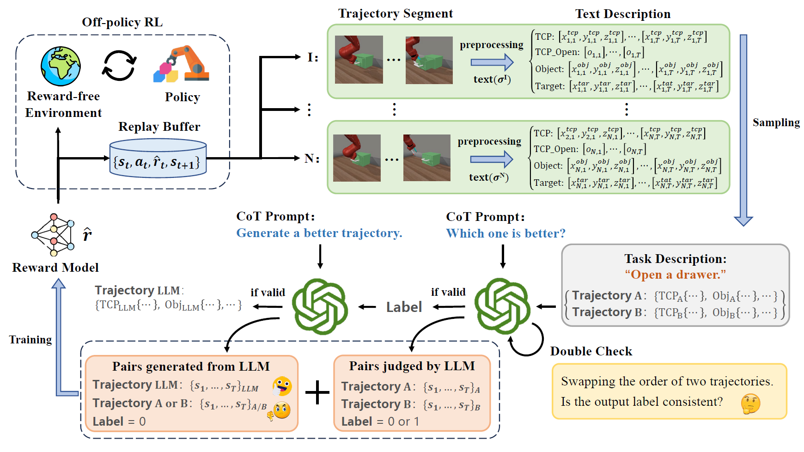

## Code for Online Preference-based Reinforcement Learning with Self-augmented Feedback from Large Language Model

Code for "Online Preference-based Reinforcement Learning with Self-augmented Feedback from Large Language Model", AAMAS 2025 paper.

## Introduction

We introduce RL-SaLLM-F, a novel approach for preference-based reinforcement learning (PbRL) that leverages large language models (LLMs) to provide trajectory feedback without human intervention or privileged reward information. RL-SaLLM-F generates self-augmented trajectory preferences and mitigates query ambiguity through a double-check mechanism, ensuring robust feedback for policy improvement. Experiments on MetaWorld tasks demonstrate its efficiency, achieving competitive performance compared to traditional PbRL methods.

<p align="center">
    <br>
    
    <br>
<p>

---


## Quick Start
1. Set your own api key, then
``` Bash
source prepare.sh
```

2. Training: an example with Sa-LLM-F
``` Bash
vlm_label=gpt-4o-mini-2024-07-18
feed_type=0
process_type=2
traj_action=False
segment=10
better_traj_gen=False
reward_batch=20
double_check=False
save_equal=False
vlm_feedback=True
for seed in 12345 23451 34512 45123 51234; do
    python train_PEBBLE.py env=metaworld_door-open-v2 vlm_label=$vlm_label segment=$segment seed=$seed agent.params.actor_lr=0.0003 agent.params.critic_lr=0.0003 gradient_update=1 activation=tanh num_unsup_steps=9000 num_train_steps=500000 agent.params.batch_size=512 double_q_critic.params.hidden_dim=256 double_q_critic.params.hidden_depth=3 diag_gaussian_actor.params.hidden_dim=256 diag_gaussian_actor.params.hidden_depth=3 reward_update=10  num_interact=5000 max_feedback=20000 reward_batch=$reward_batch reward_update=10 feed_type=$feed_type teacher_beta=-1 teacher_gamma=1 teacher_eps_mistake=0 teacher_eps_skip=0 teacher_eps_equal=0 process_type=$process_type traj_action=$traj_action better_traj_gen=$better_traj_gen double_check=$double_check save_equal=$save_equal vlm_feedback=$vlm_feedback
done
```

3. Training: an example with scripted teacher
``` Bash
vlm_label=null
feed_type=0
process_type=2
traj_action=False
segment=10
better_traj_gen=False
reward_batch=20
double_check=False
save_equal=False
for seed in 12345 23451 34512 45123 51234; do
    python train_PEBBLE.py env=metaworld_door-open-v2 vlm_label=$vlm_label segment=$segment seed=$seed agent.params.actor_lr=0.0003 agent.params.critic_lr=0.0003 gradient_update=1 activation=tanh num_unsup_steps=9000 num_train_steps=500000 agent.params.batch_size=512 double_q_critic.params.hidden_dim=256 double_q_critic.params.hidden_depth=3 diag_gaussian_actor.params.hidden_dim=256 diag_gaussian_actor.params.hidden_depth=3 reward_update=10  num_interact=5000 max_feedback=200000 reward_batch=$reward_batch reward_update=10 feed_type=$feed_type teacher_beta=-1 teacher_gamma=1 teacher_eps_mistake=0 teacher_eps_skip=0 teacher_eps_equal=0 process_type=$process_type traj_action=$traj_action better_traj_gen=$better_traj_gen double_check=$double_check save_equal=$save_equal
done
```

4. Training: an example with SAC
``` Bash
for seed in 12345 23451 34512 45123 51234; do
    python train_SAC.py env=metaworld_door-open-v2 seed=$seed agent.params.actor_lr=0.0003 agent.params.critic_lr=0.0003  num_train_steps=500000 agent.params.batch_size=512 double_q_critic.params.hidden_dim=256 double_q_critic.params.hidden_depth=3 diag_gaussian_actor.params.hidden_dim=256 diag_gaussian_actor.params.hidden_depth=3
done
```

5. For more details, see README_Bpref.md for more evalution and environment install.
   
---
## Acknowledgements

Special thanks to the following open-source projects for their inspiration and technical support:

- [Bpref](https://github.com/rll-research/BPref)
- [RL-VLM-F](https://github.com/yufeiwang63/RL-VLM-F)